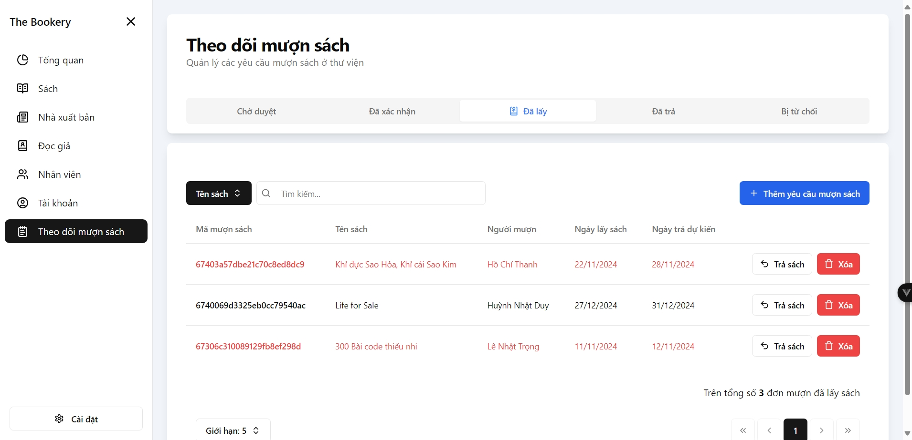

# The Bookery (Client)

The Bookery is an online platform designed to streamline library management and improve the user experience for borrowing books. This repository contains the frontend codebase for the system.

Check out: [The Bookery (Server)](https://github.com/bp82125/TheBookery-Server)

## Example Screenshots




## Tech Stack
- **Framework**: Vue 3
- **UI Library**: shadcn-vue
- **State Management**: Pinia
- **Routing**: VueRouter
- **Styling**: TailwindCSS with TailwindCSS Animate and Tailwind Merge
- **Validation**: VeeValidate with Zod
- **Utilities**: Axios, Vue-Cookies and VueUse

## Getting Started

### Prerequisites

- Node.js (v16 or later recommended)
- npm or yarn package manager

### Installation

1. Clone the repository:
   ```bash
   git clone https://github.com/bp82125/thebookery-client.git
   cd thebookery-client
   ```
2. Install dependencies:
   ```bash
   npm install
   # or
   yarn install
   ```
3. Create a Cloudinary bucket:
   - Sign up or log in to [Cloudinary](https://cloudinary.com/).
   - Navigate to your Cloudinary Dashboard.
   - Note your **Cloud Name** from the dashboard.
   - Create an **Upload Preset**:
     1. Go to **Settings** > **Upload**.
     2. Scroll to the **Upload Presets** section.
     3. Click **Add upload preset**.
     4. Configure the preset according to your needs (e.g., enable unsigned uploads if required).
     5. Save the preset name for the `VITE_CLOUDINARY_UPLOAD_PRESET` variable.

4. Configure environment variables:
   - Copy `.env.example` to `.env`:
     ```bash
     cp .env.example .env
     ```
   - Ensure the following variables are set in `.env`, and adjust them to match your API endpoints and Cloudinary storage configuration:
     ```env
     VITE_API_BASE_URL=http://localhost:3000/api/v1

     VITE_CLOUDINARY_CLOUD_NAME=cloud-name
     VITE_CLOUDINARY_UPLOAD_PRESET=upload-preset
     ```

### Development Server

Start the development server with:

```bash
npm run dev
# or
yarn dev
```

The app will be available at `http://localhost:5173` by default.

### Build for Production

To build the project for production:

```bash
npm run build
# or
yarn build
```

The production build files will be in the `dist` folder.

### Preview Production Build

To preview the production build locally:

```bash
npm run preview
# or
yarn preview
```

### Other Scripts

**Format Code**:
  ```bash
  npm run format
  # or
  yarn format
  ```
**Host Development Server on LAN**:
  ```bash
  npm run host
  # or
  yarn host
  ```

## License

This project is licensed under the MIT License. See the [LICENSE](LICENSE) file for details.
